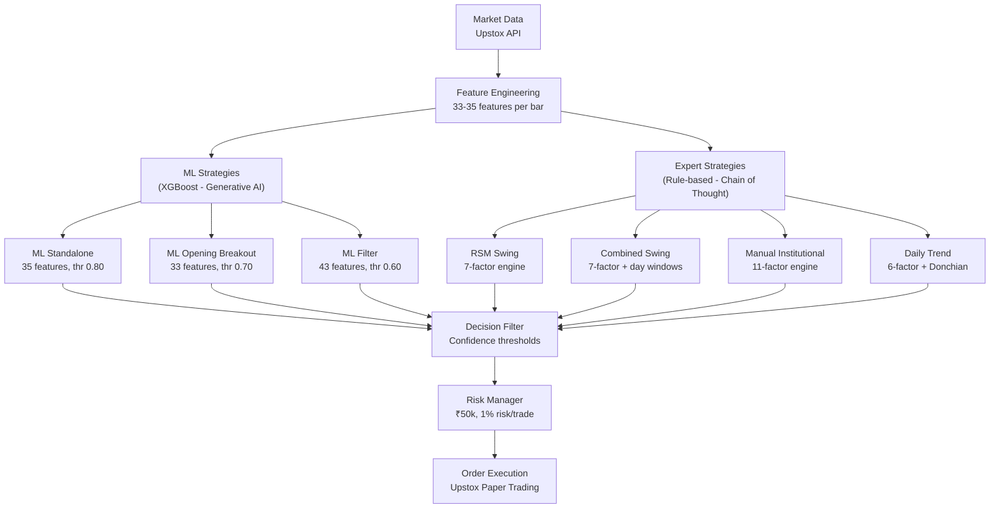
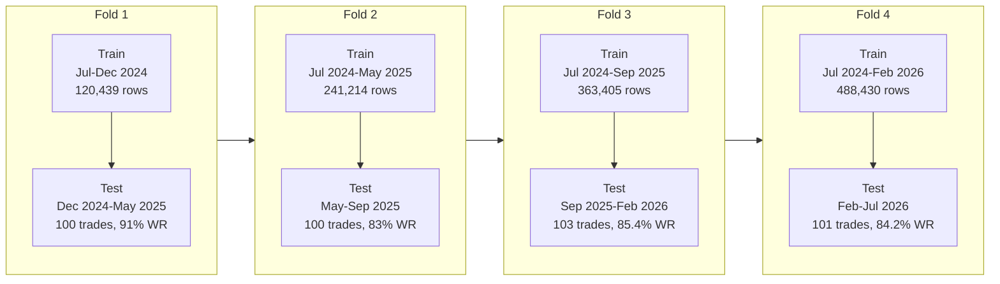
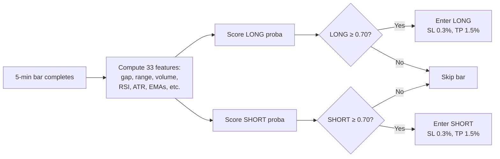
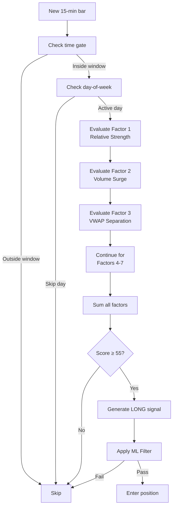
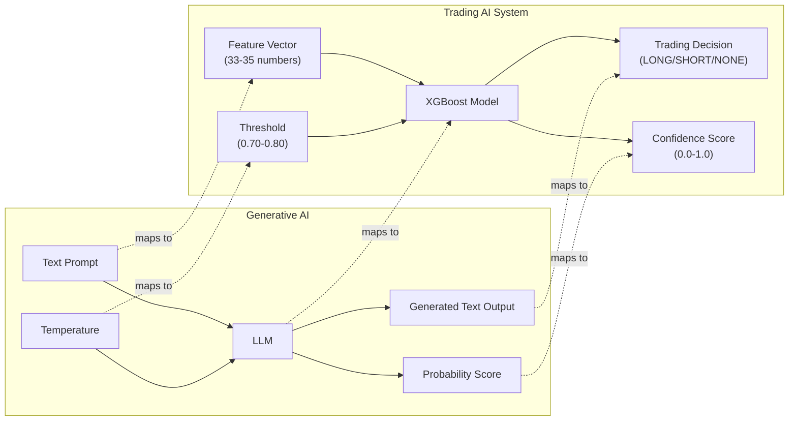

# Presentation Diagrams

Copy and paste these Mermaid diagrams into your presentation slides as needed.

---

## Diagram 1: System Architecture (Slide 5)



---

## Diagram 2: Walk-Forward Validation (Slide 8)



---

## Diagram 3: Decision Flow — ML Strategy (Slide 6)



---

## Diagram 4: Decision Flow — Expert Strategy (Slide 7)



---

## Diagram 5: Generative AI Mapping (Slide 4)



---

## Diagram 6: Results Summary (Slide 10)

```mermaid
bar
    title "Net PnL by Strategy (₹50k capital, ₹)"
    "Daily Trend": 1992944
    "ML Opening Brk": 198026
    "Combined Swing": 162382
    "RSM Swing": 104027
    "Manual Inst.": 68469
    "ML Standalone": 49985
```

*(This is a Mermaid bar chart. If your presentation software doesn't support it, draw a simple bar chart manually.)*
